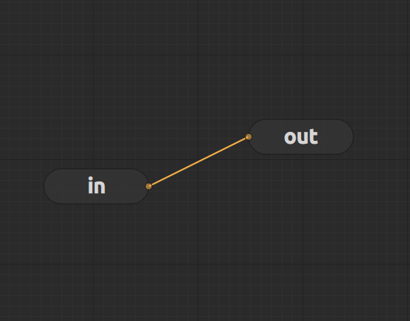

# NodeEditor-QML

**NodeEditor-QML** is a Qt QML node editor library. It aims to provide a solid foundation for any Qt software integrating a node editor. It supports use cases ranging from simple graph visualization to complex data processing graphs.


###### Video taken from [CutieDesigner](https://github.com/Arthur-Aillet/CutieDesigner), an app using **NodeEditor-QML** as it's graph framework.
</br>

**NodeEditor-QML** was based on a fork of the Qt Widgets library [nodeeditor](https://github.com/paceholder/nodeeditor), but was rewritten heavily to use Qt QML. There is features from **nodeeditor** missing as well as additional features.

## Building

The simplest way to link NodeEditor is with **FetchContent**:
```cmake
FetchContent_Declare(NodeEditor
    GIT_REPOSITORY  https://github.com/Arthur-Aillet/NodeEditor-QML.git
    GIT_TAG         ... # Set the tag of the latest commit
)

FetchContent_GetProperties(NodeEditor)

if(NOT NodeEditor_POPULATED)
 FetchContent_MakeAvailable(NodeEditor)
endif()

qt_add_qml_module(app
    ...
    TARGET NodeEditor
)

target_include_directories(app PRIVATE ${NodeEditor_BINARY_DIR}) # Allows qmllint to find QML files
target_link_libraries(app PRIVATE NodeEditor)
```

## Usage

A simple example of **NodeEditor** can be found inside [/examples/calculator](./examples/calculator/README.md)


## Features

**NodeEditor-QML** is complemented by multiple features to simplify user interaction with the graph:
- Default controls for the following actions:
    - Pan and zoom the view
    - Move, delete, copy, cut, and paste nodes
    - Connect and disconnect node ports
- Different contextual menus:
    - Basic node creation menu
    - Node creation menu with a search bar
    - Dragging a port connection to an empty area opens a node creation menu filtered with only compatible nodes.
- Save and load the graph from JSON files (developers only need to define how each node should save and restore its inner state)

**Extensible:**

The colors and theming can be configured:

###### [/examples/style](./examples/style/README.md)

And nodes or connections visuals can even be overriden with custom QML Components:

###### [/examples/custom_painters](./examples/custom_painters/README.md)

## Contributing

Any contribution is welcome!
Don't hesitate to contact me for any question with a Github issue.

## License

MIT © Arthur Aillet
