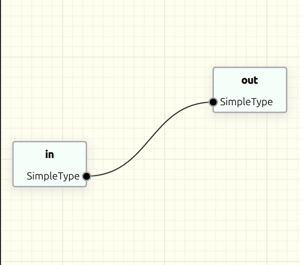

# Customize the style

To configure the looks of the default dataflow nodes/connections/background, you can change the style definined in the *DataFlowContext*.



The configuration is written in the Json format.
By default, most of the colors are derived from the system palette.

This can be disabled this way:
```cpp
  styles->followApplicationPalette(false);
```

Then the style will be fully defined by the json configuration, the default configuration can be found here: [DefaultStyle.json](../../src/resources/DefaultStyle.json)

```c++
  ...
  const auto context = new NodeEditor::DataFlowContext(graph);
  const auto styles = new StyleCollection();

  styles->followApplicationPalette(false);

  styles->setGraphicsViewStyle(GraphicsViewStyle((R"({
    "GraphicsViewStyle": {
      "BackgroundColor": [255, 255, 240],
      "FineGridColor": [245, 245, 230],
      "CoarseGridColor": [235, 235, 220]
    }
  })")));

  styles->setNodeStyle(NodeStyle(R"({
    "NodeStyle": {
      "NormalBoundaryColor": "darkgray",
      "SelectedBoundaryColor": "deepskyblue",
      "GradientColor0": "mintcream",
      "GradientColor1": "mintcream",
      "GradientColor2": "mintcream",
      "GradientColor3": "mintcream",
      "ShadowColor": [200, 200, 200],
      "ShadowEnabled": true,
      "FontColor": [10, 10, 10],
      "FontColorFaded": [100, 100, 100],
      "ConnectionPointColor": "white",
      "PenWidth": 2.0,
      "HoveredPenWidth": 2.5,
      "ConnectionPointDiameter": 10.0,
      "Opacity": 1.0
  }})"));

  styles->setConnectionStyle(ConnectionStyle(R"({
    "ConnectionStyle": {
      "ConstructionColor": "gray",
      "NormalColor": "black",
      "SelectedColor": "gray",
      "SelectedHaloColor": "deepskyblue",
      "HoveredColor": "deepskyblue",

      "LineWidth": 3.0,
      "ConstructionLineWidth": 2.0,
      "PointDiameter": 10.0,

      "UseDataDefinedColors": false
  }})"));

  context->setStyleCollection(styles);
```

To try out the custom_style example, at the project root, run:

```sh
cmake -DBUILD_EXAMPLES=on -S . -B ./build -G "Unix Makefiles"

make --no-print-directory -C build

./build/examples/custom_style/custom_style
```
